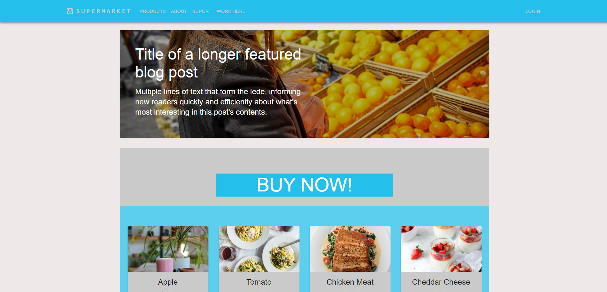
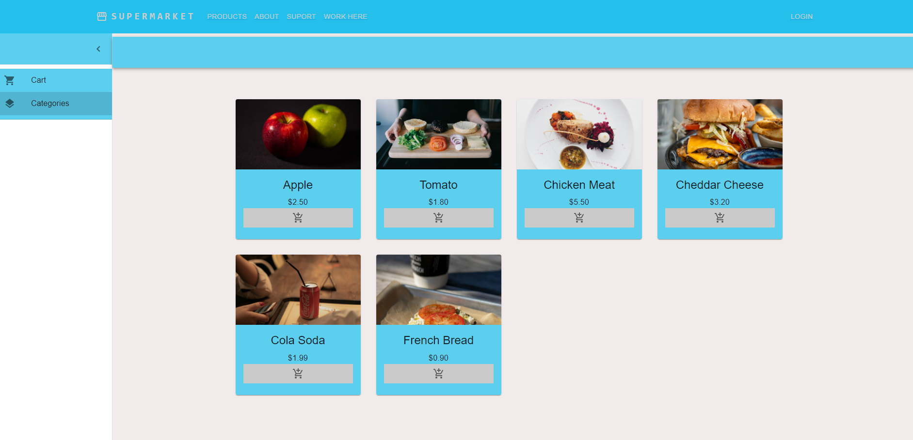
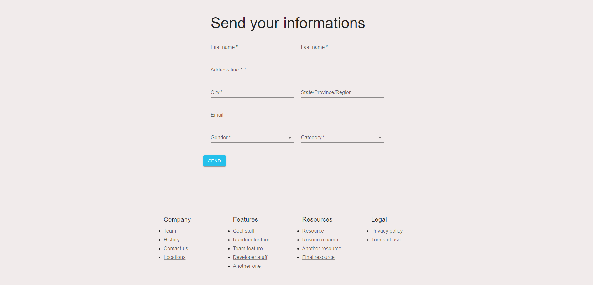
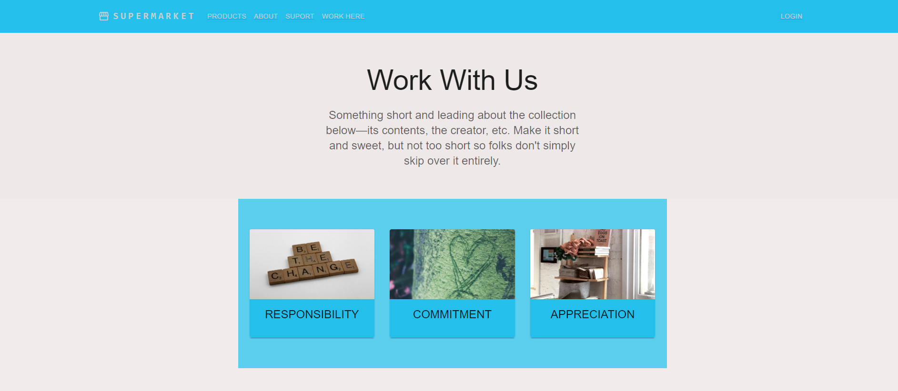
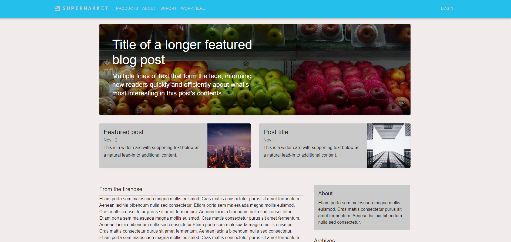

 

# Supermarket App
 

> A supermarket management system developed with React for the frontend, Node.js for the backend API, and PostgreSQL for the database

## 🛠️ Features

- **Home**: Overview of the supermarket, some products, etc.
- **About**: Company information page.
- **Contact**: Contact form for reaching out to the company.
- **Work Here**: Information about job opportunities and application process.
- **Products**: Catalog of products available in the supermarket, with search and filter options.
- **User Authentication**: Login and registration system for user account management.

## 💻 Technologies Used

- **Frontend**:
  - Developed with React.js
  - Styled components with Material-UI
  - Routing managed with React Router

- **Backend**:
  - API built with Node.js
  - Utilization of Express.js for routing

- **Database**:
  - PostgreSQL used for data storage
  - Relational schema defined to represent information about products, users, orders, etc.

## 📸 User Interface

Here are some screenshots of the project:

    Home page: Browse, search, and filter products. 
 
    Product Catalog: Browse, search, and filter products. 
 
    Contact Form: Reach out to the supermarket team. 
 
    Job Opportunities: Information about career options. 
 
    More About: More informations about the supermarket. 
 
    History: View highlights and more important information 

