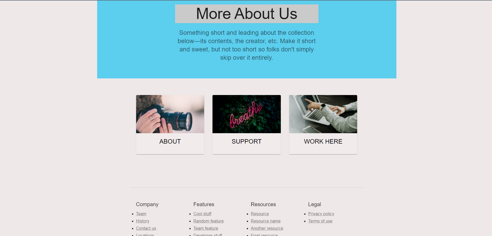

# Supermarket App

Welcome to the Supermarket App project! This is a supermarket management system developed with React for the frontend, Node.js for the backend API, and PostgreSQL for the database.

## Features

- **Home**: Overview of the supermarket, some products, etc.
- **About**: Company information page.
- **Contact**: Contact form for reaching out to the company.
- **Work Here**: Information about job opportunities and application process.
- **Products**: Catalog of products available in the supermarket, with search and filter options.
- **User Authentication**: Login and registration system for user account management.

## Technologies Used

- **Frontend**:
  - Developed with React.js
  - Styled components with Material-UI
  - Routing managed with React Router

- **Backend**:
  - API built with Node.js
  - Utilization of Express.js for routing

- **Database**:
  - PostgreSQL used for data storage
  - Relational schema defined to represent information about products, users, orders, etc.

## In Development

- Addition of more features (cart, login)...
- Improvements in user interface...
- Bug fixes...

## User Interface

Here are some screenshots of the project:

  
  
  

  
  
  

